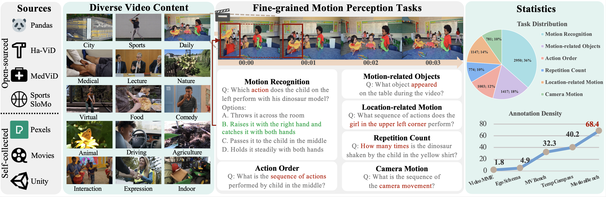

# MotionBench: Benchmarking and Improving Fine-grained Video Motion Understanding for Vision Language Models


  

<font size=7><div align='center' > [[🍎 Project Page](https://motion-bench.github.io/)] [[📖 arXiv Paper](https://arxiv.org/abs/2501.02955)] [[📊 Dataset](https://huggingface.co/datasets/THUDM/MotionBench)][[🏆 Leaderboard](https://motion-bench.github.io/#leaderboard)][[🏆 Huggingface Leaderboard](https://huggingface.co/spaces/THUDM/MotionBench)]  </div></font>

<p align="center">
    
</p>


MotionBench aims to guide and motivate the development of more capable video understanding models, emphasizing the importance of fine-grained motion comprehension.

---

## 🔥 News

* **`2025.02.27`** 🎉🎉🎉 MotionBench is accepted by CVPR 2025!!
* **`2025.01.06`** 🌟 We released MotionBench, a new benchmark for fine-grained motion comprehension!

## Introduction

In recent years, vision language models (VLMs) have made significant advancements in video understanding. However, a crucial capability — fine-grained motion comprehension — remains under-explored in current benchmarks. To address this gap, we propose MotionBench, a comprehensive evaluation benchmark designed to assess the fine-grained motion comprehension of video understanding models. 

### Features

1. **Core Capabilities**: Six core capabilities for fine-grained motion understanding, enabling the evaluation of motion-level perception.
2. **Diverse Data**: MotionBench collects diverse video from the web, public datasets, and self-synthetic videos generated via Unity3, capturing a broad distribution of real-world
application.
3. **High-Quality Annotations**: Reliable benchmark with meticulous human annotation and multi-stage quality control processes.

<p align="center">
    
</p>

## Dataset

### License

Our dataset is under the CC-BY-NC-SA-4.0 license.

LVBench is only used for academic research. Commercial use in any form is prohibited. We do not own the copyright of any raw video files.

If there is any infringement in MotionBench, please contact shiyu.huang@aminer.cn or directly raise an issue, and we will remove it immediately.

### Download

Install video2dataset first:

```shell
pip install video2dataset
pip uninstall transformer-engine
```

Then you should download `video_info.meta.jsonl` from [Huggingface](https://huggingface.co/datasets/THUDM/MotionBench) and
put it in the `data` directory.

Each entry in the `video_info.meta.jsonl` file contains a video sample. Some of the dataset has the ground truth answer (the DEV set) and some not (the TEST set). You could use the DEV set to optimize your dataset and upload the answer file to our [leaderboard](https://huggingface.co/spaces/THUDM/MotionBench) to see your model's performance.

#### Caption dataset
Part of our dataset are derived from our self-annotated detailed video caption. we additionally release a dataset of 5,000 videos with manually annotated fine-grained motion descriptions, which are annotated and double-checked together with the benchmark annotation process. Each video includes dynamic information descriptions with annotation density reaching 12.63 words per second, providing researchers with resources for further development and training to enhance video models’ motion-level comprehension capabilities. 

#### Self-collected dataset
We provide the download link for all self-collected data. 


#### Publically available dataset
For publically available data. we do not provide the orginal video files. You could download them from the original repo:
```
1. MedVid: https://github.com/deepaknlp/MedVidQACL
2. SportsSloMo: https://cvlab.cse.msu.edu/project-svw.html
3. HA-ViD: https://iai-hrc.github.io/ha-vid
```
After downloading the above mentioned dataset, find the mapping from the downloaded names to the filenames in our benchmark with the mapping file:
```
data/mapping.json
```
Then, cut the video to clips using the last two integers separated by `_`. 

e.g., the video file `S10A13I22S1.mp4` is mapped to file `ef476626-3499-40c2-bbd6-5004223d1ada` according to the mapping file. To obtain the final test case `ef476626-3499-40c2-bbd6-5004223d1ada_58_59` in `video_info.meta.jsonl`, you should cut the video clip from `58` second to `59` second, yielding the final video sample for benchmarking.

## Install MotionBench

```shell
pip install -e .
```

## Get Evaluation Results and Submit to Leaderboard

(Note: if you want to try the evaluation quickly, you can use the `scripts/construct_random_answers.py` to prepare a
random answer file.)

```shell
cd scripts
python test_acc.py
```

After the execution, you will get an evaluation results file `random_answers.json` in the `scripts` directory. You can submit the
results to the [leaderboard](https://huggingface.co/spaces/THUDM/MotionBench).

## 📈 Results

- **Model Comparision:**

<p align="center">
    
</p>

- **Benchmark Comparison:**

<p align="center">
    
</p>


- **Answer Distribution:**

<p align="center">
    
</p>

## Citation

If you find our work helpful for your research, please consider citing our work.

```bibtex
@misc{hong2024motionbench,
      title={MotionBench: Benchmarking and Improving Fine-grained Video Motion Understanding for Vision Language Models}, 
      author={Wenyi Hong and Yean Cheng and Zhuoyi Yang and Weihan Wang and Lefan Wang and Xiaotao Gu and Shiyu Huang and Yuxiao Dong and Jie Tang},
      year={2024},
      eprint={2501.02955},
      archivePrefix={arXiv},
      primaryClass={cs.CV}
}
```